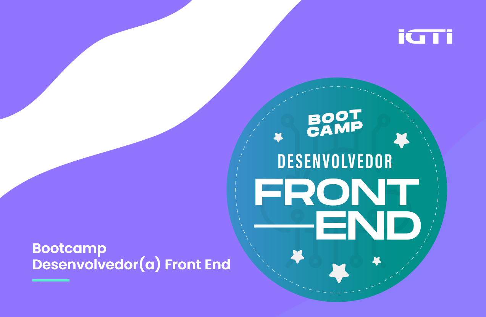

<h1 align="center"> :rocket: <strong>Bootcamp IGTI - Desenvolvedor FrontEnd </strong></h1>

<strong>ANGULAR | REACT | VUE </strong>

Bootcamp com duração de 148 horas (2 meses) que tem como objetivo apresentar conceitos fundamentais sobre o desenvolvimento Front-end e praticar codificação utilizando as 3 principais ferramentas de desenvolvimento Front-end.
 

<h2>Conteúdo</h2>

:pushpin: [Módulo 1](https://github.com/kitkoshino/bootcamp_IGTI_frontend_developer/tree/master/modulo1) - HTML 5, CSS 3, Javascript puro  
 - Trabalho prático: [Super Calculadora](https://github.com/kitkoshino/bootcamp_IGTI_frontend_developer/tree/master/modulo1/trabalho-pratico/super-calculadora)
- Desafio: Search devs

:pushpin: Módulo 2 - Angular  
:pushpin: Módulo 3 - React  
:pushpin: Módulo 2 - Vue  