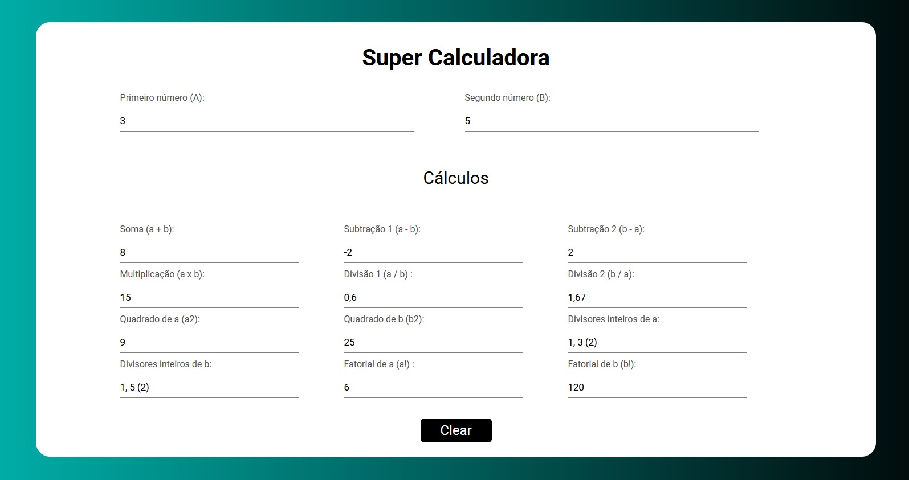

<h1 align="center"> :dart: <strong>Super Calculadora </strong></h1>

Trabalho prático Módulo 1

## Desafio
Implementar, utilizando HTML, CSS e JavaScript puro, uma aplicação que efetue diversos cálculos através de dois números definidos pelo usuário,através de doisinputsdo tipo number

 

## :computer: Tecnologias
- Javascript (puro)
- HTML 5
- CSS 3