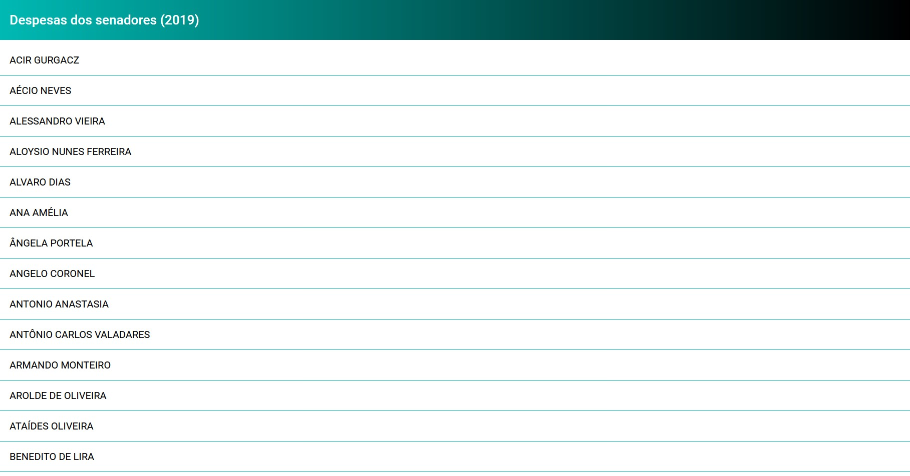
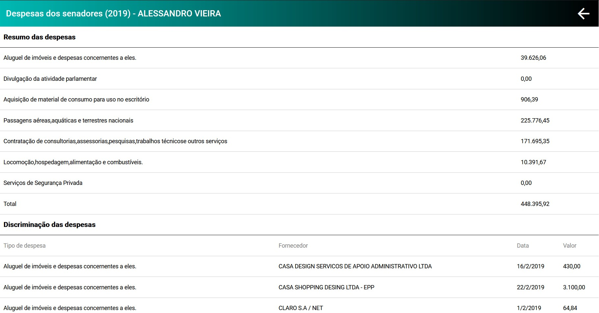

<h1 align="center"> :dart: <strong>Despesas de Senadores </strong></h1>
<p align="center">Desafio Módulo 2</p>
<div>
  
  
</div>

## :rocket: Desafio
Construir aplicação utilizando Angular para exibir as despesas  dos senadores no ano de 2019, conforme base de dados fornecida.

- Ao clicar em nome da lista, abre-se uma página com as respectivas despesas.

<br />

## :computer: Tecnologias
- Angular
- Typescript
- HTML 5
- CSS 3
- Json server

<br />

## :video_game: Executar

```bash
  #Instalar dependências:
    $ npm install

  #Subir backend com json server:
    $ json-server --watch despesas.json

  # Rodar Aplicação:
    $ npm start
```