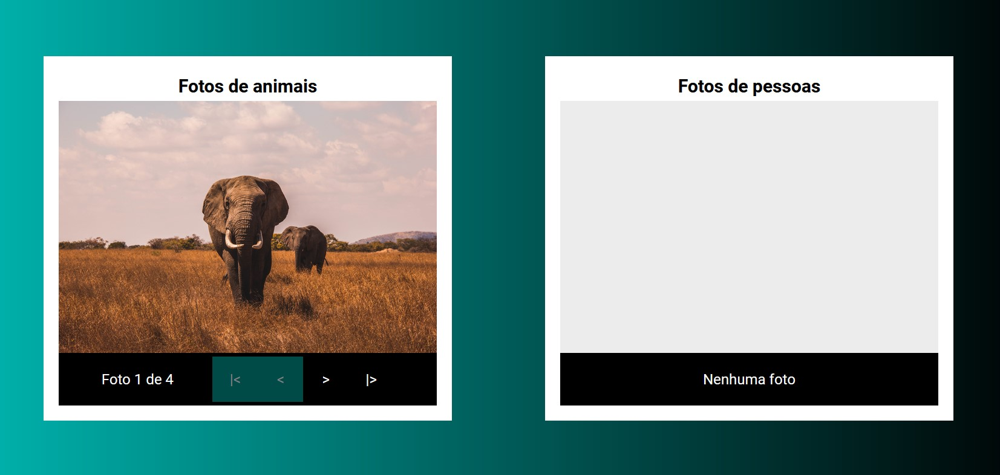

<h1 align="center"> :dart: <strong>Super Calculadora </strong></h1>
<p align="center">Trabalho prático Módulo 2</p>
<p align="center"></p>

## :rocket: Desafio
Construir aplicação utilizando Angular para exibir uma galeria de fotos.

<br />

## :computer: Tecnologias
- Angular
- Typescript
- HTML 5
- CSS 3

<br />


## :video_game: Executar

```bash
 #Instalar dependências:
    $ npm install

    # Rodar Aplicação:
    $ npm start
```