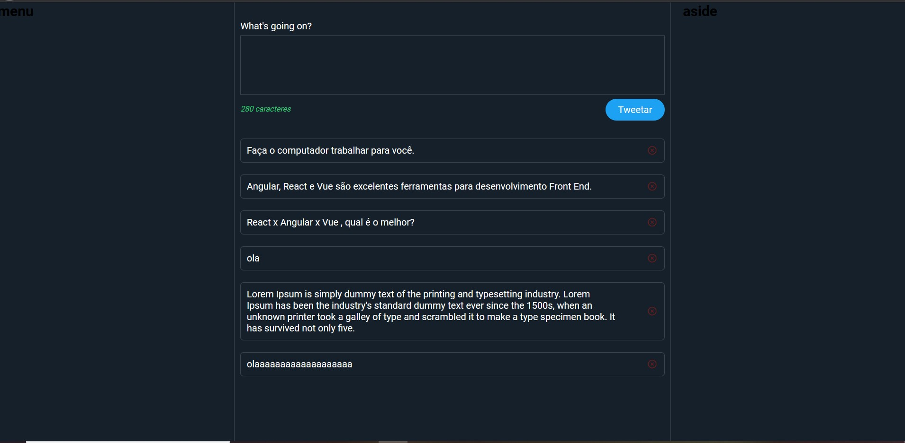
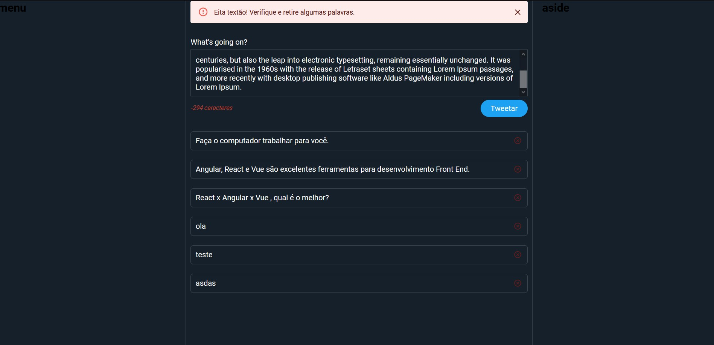

<h1 align="center"> :dart: <strong> React Twitter </strong></h1>
<p align="center">Desafio Módulo 3</p>
<p align="center"></p>
<p align="center"></p>


## Desafio

Criar uma aplicação com React para simular a interface principal do Twitter (react-twitter).

<br />

## :computer: Tecnologias

- React
- Javascript
- HTML 5
- CSS 3 / Scss
- Axios

<br />

- Material UI
- Json Server

<br />

## :video_game: Run

```bash
    #Instalar dependências:
    $ npm install

    # Rodar json server:
    $ json-server --watch tweets.json --port 3333

    # Iniciar aplicação:
    $ npm start
```