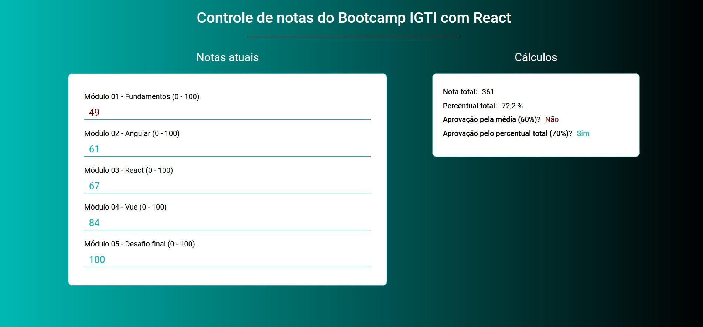

<h1 align="center"> :dart: <strong>Controle de notas do Bootcamp </strong></h1>
<p align="center">Trabalho prático Módulo 3</p>
<p align="center"></p>

## Desafio

Construir, utilizando React, uma aplicação para controlar as notas dos Módulos dos Bootcamps do IGTI e indicar se o aluno seráaprovado conforme os seguintes critérios,que foramextraídos do PPC (Plano Pedagógico dos Cursos). Caso consiga apenas um dos dois critérios abaixo, o aluno(a) setorna apto(a)a obter o certificado:

- Atingir 60%de aproveitamento em cada um dos 5 módulos
- OU atingir 70% de aproveitamento na soma total de pontos do Bootcamp.

<br />

## :computer: Tecnologias

- React
- Javascript
- HTML 5
- CSS 3 / Scss

<br />

## :video_game: Run

```bash
    #Instalar dependências:
    $ npm install

    # Rodar Aplicação:
    $ npm start
```